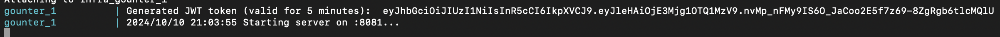

# Gounter

**Gounter** is a simple counter application built in Go that provides RESTful APIs for managing counters. 

## Table of Contents

- [Gounter](#gounter)
  - [Table of Contents](#table-of-contents)
  - [Installation](#installation)
  - [Usage](#usage)
    - [Create counter](#create-counter)
    - [Increment counter](#increment-counter)
    - [Delete counter](#delete-counter)
  - [API Documentation](#api-documentation)
  - [Tests](#tests)
    - [Unit Test](#unit-test)
    - [Integration Test](#integration-test)
  - [Makefile Commands](#makefile-commands)

## Installation

Make sure you have [Docker](https://www.docker.com/get-started) installed on your machine. Clone this repository and navigate to the project directory:

```bash
git clone https://github.com/ambareeshb/gounter
```

## Usage
```bash
cd gounter
make run
```

Then the app is available at `localhost:8081`

On start up the application will create a JWT Token which is valid for 5 minutes which can be passed as Bearer token for all requests.On every request we are validating the structure and expiry of the token. 
You can also use any valid JWT token, we are creating during startup for convenience.



Check the file at `test/integration/integration_test.go`, Which contains some basic cURL commands. Or to test quickly:
### Create counter

```bash
curl -X POST -k http://localhost:8081/counter/create \
                  -H "Authorization: Bearer <token>" \
                  -H "Content-Type: application/json" \
                  -d '{"name":"counter name"}'
```

### Increment counter

```bash
curl -X POST -k http://localhost:8081/counter/increment \
                  -H "Authorization: Bearer <token>" \
                  -H "Content-Type: application/json" \
                  -d '{"id":"valid id from the previous creation step"}'
```

### Delete counter

```bash
curl -X DELETE "http://localhost:8081/counter/delete?id=<valid_id_from_first_step>" \
                  -H "Authorization: Bearer <token>" 
```


## API Documentation
The Swagger documentation for the APIs is available at:

```bash
make serve-swagger
```
visit `http://localhost:8080` for API documentation

You can view the API endpoints and their details there.

## Tests
  ### Unit Test
   `make test` to run all the unit tests
  ### Integration Test 
  `make test-integration` to run integration tests. For the please note that we need to manually run the server using `make run`.

## Makefile Commands
This project uses a Makefile for various tasks. Here are the available commands:

```bash
make build: Build the application.
make run: Run the application.
make test: Run unit tests.
make test-integration: Run integration tests (the application must be running).
make install-deps: Install richgo if it is not available.
make clean: Clean up build artifacts and stop the application.
make serve-swagger: Serve documentation on http://localhost:8080
make create-migration: Create a new database migration file.
```
